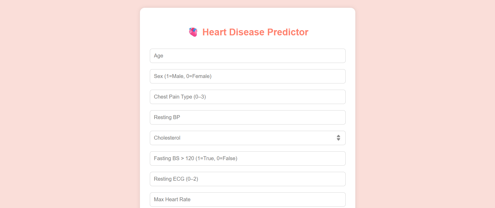

## 🩺 Problem Statement
Heart disease is one of the leading causes of death worldwide. Many people don't realize they are at risk until it's too late. Doctors and hospitals often need fast, early predictions to help patients get the right treatment. However, not everyone has access to advanced medical tools.


## ✅ Solution
This project uses Machine Learning to help predict if a person is likely to have heart disease based on their health information. Users can fill out a form with medical data (like age, cholesterol, blood pressure), and the system will predict whether they might have heart disease. The model is trained using real medical data and is easy to use through a simple web interface.

# ❤️ Heart Disease Prediction App (ML + FastAPI + HTML/CSS)

This is a complete heart disease prediction web application that uses a machine learning model trained on the UCI Heart Disease dataset. The project includes a Python backend using FastAPI, a trained model saved as `.pkl`, and a simple frontend using HTML and CSS.


##  Features

- Predicts heart disease based on input symptoms
- Machine learning model trained using Random Forest
- Backend powered by FastAPI
- Web frontend with a styled form
- Hosted live demo link (optional)


## 🗂️ Project Structure

HEART_DISEASE_PREDICTION
├── static/
│ ├── index.html # Frontend HTML form
│ ├── style.css # Styles for the form
├── heart.csv # Dataset used for training
├── heart.ipynb # Jupyter Notebook for training and analysis
├── heart_disease_model.pkl # Trained ML model
├── main.py # FastAPI backend
└── README.md # Project description


## 🧠 Machine Learning Model

- Dataset: UCI Heart Disease Dataset
- Preprocessing: Handled missing values, feature selection
- Models Tried: Decision Tree, Random Forest, SVM, KNN
- Final Model: ✅ Random Forest Classifier (best performance)
- Evaluation Metrics: Accuracy, Recall, Precision, F1-score


##  How to Run Locally

### 1. Clone this repository
```bash
git clone https://github.com/yourusername/heart-disease-prediction-app.git
cd heart-disease-prediction-app

2. Install dependencies

pip install fastapi uvicorn scikit-learn pandas joblib python-multipart

3. Start the FastAPI server

uvicorn main:app --reload

4. Open the web form
Visit http://127.0.0.1:8000/static/index.html